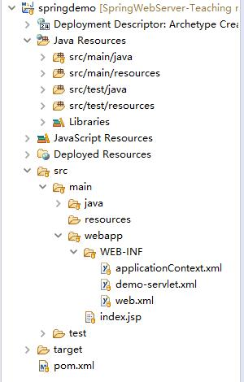
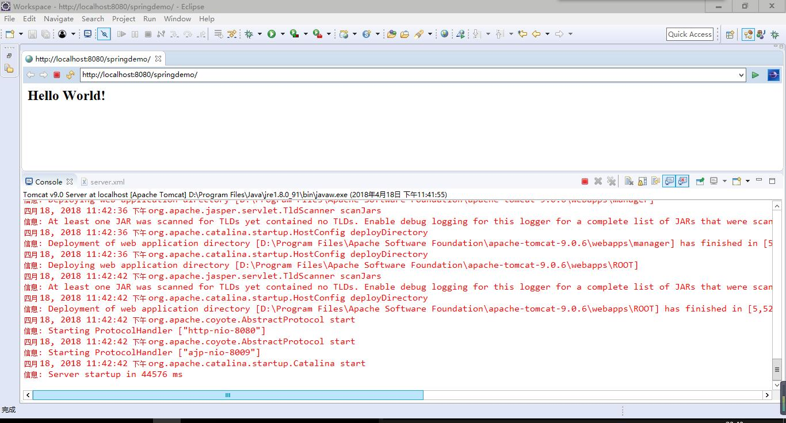
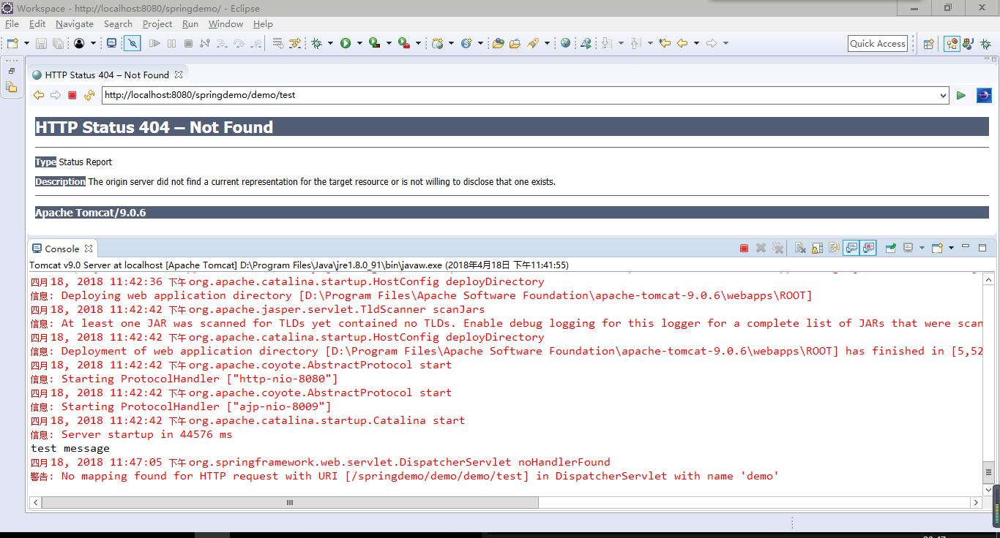
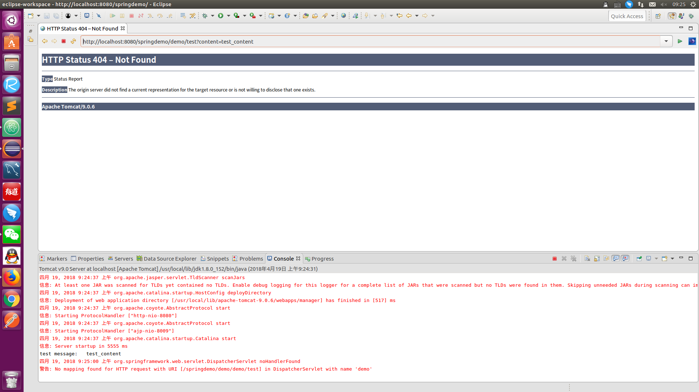
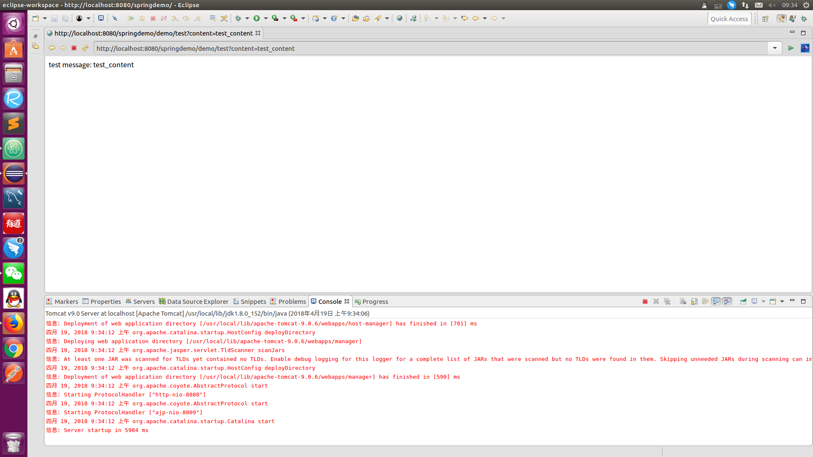
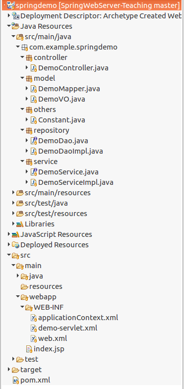

# Chapter 5 —— 编写工程

## 前言

终于，我们要开始落实到工程代码上了，接下来可能会花费读者大量的时间来学习本章内容，所以在开始阅读本章内容前，请确保你有连续的可以专心学习的时间，并且最好跟我一起在IDE上编写代码。

---
## 一、 从简易的Demo开始

### 1. 创建工程

eclipse创建一个Maven工程，选择webapp类型，具体步骤参考我的另一篇教程《[使用Maven构建Java Web工程的教程](https://github.com/frogfans/MavenBuildJavaWeb-Teaching)》。

为了便于读者和本文对照，我建议读者将"Group Id"设置为"com.example"，"Artifact Id"设为"springdemo"，"Package"会自动生成。

### 2. 依赖资源

然后在pom.xml中依赖Spring相关、MySQL相关、JDBC相关，JSON相关的jar包，得到这样：
```
<project xmlns="http://maven.apache.org/POM/4.0.0"
	xmlns:xsi="http://www.w3.org/2001/XMLSchema-instance"
	xsi:schemaLocation="http://maven.apache.org/POM/4.0.0 http://maven.apache.org/maven-v4_0_0.xsd">
	<modelVersion>4.0.0</modelVersion>
	<groupId>com.example</groupId>
	<artifactId>springdemo</artifactId>
	<packaging>war</packaging>
	<version>0.0.1-SNAPSHOT</version>
	<name>springdemo Maven Webapp</name>
	<url>http://maven.apache.org</url>
	<dependencies>
		<!-- junit -->
		<dependency>
			<groupId>junit</groupId>
			<artifactId>junit</artifactId>
			<version>3.8.1</version>
			<scope>test</scope>
		</dependency>
		<!-- servlet -->
		<dependency>
			<groupId>javax.servlet</groupId>
			<artifactId>servlet-api</artifactId>
			<version>2.5</version>
			<scope>provided</scope>
		</dependency>
		<!-- spring-context -->
		<dependency>
			<groupId>org.springframework</groupId>
			<artifactId>spring-context</artifactId>
			<version>5.0.4.RELEASE</version>
		</dependency>
		<!-- spring-beans -->
		<dependency>
			<groupId>org.springframework</groupId>
			<artifactId>spring-beans</artifactId>
			<version>5.0.4.RELEASE</version>
		</dependency>
		<!-- spring-web -->
		<dependency>
			<groupId>org.springframework</groupId>
			<artifactId>spring-web</artifactId>
			<version>5.0.4.RELEASE</version>
		</dependency>
		<!-- spring-webmvc -->
		<dependency>
			<groupId>org.springframework</groupId>
			<artifactId>spring-webmvc</artifactId>
			<version>5.0.4.RELEASE</version>
		</dependency>
		<!-- spring-jdbc -->
		<dependency>
			<groupId>org.springframework</groupId>
			<artifactId>spring-jdbc</artifactId>
			<version>5.0.4.RELEASE</version>
		</dependency>
		<!-- spring-transaction -->
		<dependency>
			<groupId>org.springframework</groupId>
			<artifactId>spring-tx</artifactId>
			<version>5.0.4.RELEASE</version>
		</dependency>
		<!-- mysql-connector -->
		<dependency>
			<groupId>mysql</groupId>
			<artifactId>mysql-connector-java</artifactId>
			<version>6.0.6</version>
		</dependency>
		<!-- fastjson -->
		<dependency>
			<groupId>com.alibaba</groupId>
			<artifactId>fastjson</artifactId>
			<version>1.2.47</version>
		</dependency>
	</dependencies>
	<build>
		<finalName>springdemo</finalName>
	</build>
</project>
```

你也可以通过[Maven仓库](http://mvnrepository.com/)去查找需要的版本进行依赖。

### 3. 实现Controller

在src/main/java这个文件夹下创建一个名为"com.example.springdemo"的package。

在package下创建一个名为"DemoController"的class。

给DemoController加上"@Controller"注解，告诉Framework这是一个Controller。

再给DemoController加上"@RequestMapping"注解，括号里设置url，例如："@RequestMapping(value = "/demo")"(省略value则默认是value的值)。

添加一个处理请求的方法，同样加上"@RequestMapping"注解并设置url和请求方法，例如："@RequestMapping(value = "/test", method = RequestMethod.GET)"，那么此方法映射的请求url相对路径就是Controller的路径再拼接方法的路径，接收的请求方法是GET类型。

完整示例：
```
package com.example.springdemo;

import org.springframework.stereotype.Controller;
import org.springframework.web.bind.annotation.RequestMapping;
import org.springframework.web.bind.annotation.RequestMethod;

@Controller
@RequestMapping("/demo")
public class DemoController {

	@RequestMapping(value = "/test", method = RequestMethod.GET)
	public void test() {
		System.out.println("test message");
	}
}
```

### 4. 配置xml文件

找到"/webapp/WEB-INF"下的"web.xml"文件，定义一个DispatcherServlet，这里用框架自带的：
```
<servlet>
	<servlet-name>demo</servlet-name>
	<servlet-class>
		org.springframework.web.servlet.DispatcherServlet
	</servlet-class>
	<load-on-startup>1</load-on-startup>
</servlet>
```

名字叫"demo"，"load-on-startup"表示启动顺序，大于或等于0时表示Spring容器启动时便启动这个servlet，数字越小的，启动优先级越高。

然后定义这个名叫"demo"的DispatcherServlet负责分发哪些url的请求，这里我们让它分发所有的请求：
```
<servlet-mapping>
	<servlet-name>demo</servlet-name>
	<url-pattern>/</url-pattern>
</servlet-mapping>
```

负责请求分发的servlet定义好了，我们还要告诉它处理这些请求的Controller在哪里，因此我们需要创建一个用这里的servlet名称为前缀，"-servlet"为后缀的xml文件，即"demo-servlet.xml"(这是固定格式，如果实在想用自定义名称的，需要另外配置，读者可以自行查阅相关教程)，并在里面告诉容器去哪里找Controller：
```
<context:component-scan base-package="com.example.springdemo" />
```

这一行代码，告诉容器扫描"com.example.springdemo"这个包下面所有的Controller，其实不止是Controller，其他的组件也是在这个扫描范围内的，比如Service。

完整示例：
```
<?xml version="1.0" encoding="UTF-8"?>
<beans xmlns="http://www.springframework.org/schema/beans"
	xmlns:context="http://www.springframework.org/schema/context"
	xmlns:xsi="http://www.w3.org/2001/XMLSchema-instance"
	xsi:schemaLocation="
   http://www.springframework.org/schema/beans     
   http://www.springframework.org/schema/beans/spring-beans-3.0.xsd
   http://www.springframework.org/schema/context
   http://www.springframework.org/schema/context/spring-context-3.0.xsd">

	<context:component-scan base-package="com.example.springdemo" />

</beans>
```

接下来回想我们在第三章从xml文件获取bean时用到的"ApplicationContext"，同样，我们即使不在代码中直接出现这个获取操作，也需要通过xml文件来定义这个操作。

创建一个名为"applicationContext"的xml文件，里面就可以写各种复用的bean了。由于我们将要用到很多注解，因此为了让容器认识这些注解，还得在这个文件里加入一行：
```
<context:annotation-config />
```

完整示例：
```
<?xml version="1.0" encoding="UTF-8"?>
<beans xmlns="http://www.springframework.org/schema/beans"
	xmlns:xsi="http://www.w3.org/2001/XMLSchema-instance"
	xmlns:context="http://www.springframework.org/schema/context"
	xsi:schemaLocation="http://www.springframework.org/schema/beans
    http://www.springframework.org/schema/beans/spring-beans-3.0.xsd
    http://www.springframework.org/schema/context
    http://www.springframework.org/schema/context/spring-context-3.0.xsd">

	<context:annotation-config />

</beans>
```

写了这个加载bean的文件，但是容器不知道要去调用这个文件啊，所以又回到"web.xml"中，加上这两段：
```
<context-param>
		<param-name>contextConfigLocation</param-name>
		<param-value>/WEB-INF/applicationContext.xml</param-value>
</context-param>

<listener>
		<listener-class>org.springframework.web.context.ContextLoaderListener</listener-class>
</listener>
```

告诉容器，先调用这个文件去执行相关设置，然后监听我加载bean的需求。

至此，完整的web.xml示例：
```
<?xml version="1.0" encoding="UTF-8"?>
<web-app id="WebApp_ID" version="2.4"
	xmlns="http://java.sun.com/xml/ns/j2ee" xmlns:xsi="http://www.w3.org/2001/XMLSchema-instance"
	xsi:schemaLocation="http://java.sun.com/xml/ns/j2ee
   http://java.sun.com/xml/ns/j2ee/web-app_2_4.xsd">

		<display-name>Archetype Created Web Application</display-name>

		<!-- spring-servlet -->
		<servlet>
			<servlet-name>demo</servlet-name>
			<servlet-class>
				org.springframework.web.servlet.DispatcherServlet
			</servlet-class>
			<load-on-startup>1</load-on-startup>
		</servlet>

		<servlet-mapping>
			<servlet-name>demo</servlet-name>
			<url-pattern>/</url-pattern>
		</servlet-mapping>

		<!-- spring-config -->
		<context-param>
			<param-name>contextConfigLocation</param-name>
			<param-value>/WEB-INF/applicationContext.xml</param-value>
		</context-param>

		<listener>
			<listener-class>org.springframework.web.context.ContextLoaderListener</listener-class>
		</listener>
</web-app>
```

工程目录结构为：



### 5. 运行

工程右键 - Run As - Run on Server，选择你的Tomcat服务器，如果一切顺利的话，eclipse会自动弹出网页，如果没有弹出，可以在浏览器输入：http://localhost:8080/springdemo/



此时显示的便是"/webapp"目录下的"index.jsp"文件的页面。

我们尝试输入刚才在Controller中定义的请求处理对应的url：http://localhost:8080/springdemo/demo/test

控制台输出了方法中的内容：



会报错404找不到页面，这是必然的，因为我们没有写这个url对应的页面，我们只需要有一个可以处理请求的入口就行了。

---
## 二、 接收前端请求

在Controller的请求方法中使用"@RequestParam"注解可以设置接收的请求参数，例如："@RequestParam(name = "content", required = false) String string"，这一段告诉容器，这个方法接收一个参数名为"content"的String类型参数，它的值赋给"string"，由"required = false"可知，这个参数不是必须的，完整示例：
```
package com.example.springdemo;

import org.springframework.stereotype.Controller;
import org.springframework.web.bind.annotation.RequestMapping;
import org.springframework.web.bind.annotation.RequestMethod;
import org.springframework.web.bind.annotation.RequestParam;

@Controller
@RequestMapping("/demo")
public class DemoController {

	@RequestMapping(value = "/test", method = RequestMethod.GET)
	public void test(@RequestParam(name = "content", required = false) String string) {
		System.out.println("test message:\t" + string);
	}
}
```

然后在浏览器中输入：http://localhost:8080/springdemo/demo/test?content=test_content



通常我们也可以简化这一段注解，省去括号内容，它意味着入参即为请求的参数类型和名称，并且是必须的，完整示例：
```
package com.example.springdemo;

import org.springframework.stereotype.Controller;
import org.springframework.web.bind.annotation.RequestMapping;
import org.springframework.web.bind.annotation.RequestMethod;
import org.springframework.web.bind.annotation.RequestParam;

@Controller
@RequestMapping("/demo")
public class DemoController {

	@RequestMapping(value = "/test", method = RequestMethod.GET)
	public void test(@RequestParam String content) {
		System.out.println("test message:\t" + content);
	}
}
```

---
## 三、 返回服务端的响应

在Controller的请求方法前使用"@ResponseBody"注解，告诉容器我们这个方法要返回响应体，完整示例：
```
package com.example.springdemo;

import org.springframework.stereotype.Controller;
import org.springframework.web.bind.annotation.RequestMapping;
import org.springframework.web.bind.annotation.RequestMethod;
import org.springframework.web.bind.annotation.RequestParam;
import org.springframework.web.bind.annotation.ResponseBody;

@Controller
@RequestMapping("/demo")
public class DemoController {

	@RequestMapping(value = "/test", method = RequestMethod.GET)
	@ResponseBody
	public String test(@RequestParam String content) {
		return "test message:\t" + content;
	}
}
```

然后我们在浏览器中输入：http://localhost:8080/springdemo/demo/test?content=test_content



前端已经可以收到来自服务器的响应，自此，我们已经打通了"浏览器 - 服务器 - 浏览器"这条回路。

---
## 四、 实现MVC架构的组件

### 1. 分包

根据MVC思想，按照我们第四章学习的架构，接下来我们需要划分五大模块，并创建这几个package：

- controller
- service
- repository
- model
- others

名字仅做参考，读者可以根据个人喜好来命名任意一个class或者package。

controller包存放的class是与前端请求进行映射的"**控制层**"。

service包存放的是处理业务的接口和其实现类的"**活动层**"。

repository包存放的是操作数据库的接口和其实现类的"**访问层**"。

model包存放的是用来对应数据库表的POJO(POJO是非常简易的JavaBean，它仅由三部分构成，属性、setter和getter，没有业务逻辑，常用于对应数据库中的一张表的字段)和其转换关系的"**持久层**"。

others包用来放一些不好归类的东西，比如定义字段的静态常量类。

### 2. 建立持久层

因为上层的模块依赖于下层，所以我们需要自下而上地开发，先从Model开始。

定义一个POJO，假设它有"id"和"name"两个属性，完整示例：
```
package com.example.springdemo.model;

public class DemoVO {
	private int id;
	private String name;

	public void setId(int id) {
		this.id = id;
	}

	public int getId() {
		return id;
	}

	public void setName(String name) {
		this.name = name;
	}

	public String getName() {
		return name;
	}
}
```

然后我们需要定义一个和数据库表的字段映射关系，这将在后面的jdbc操作中使用到，完整示例：
```
package com.example.springdemo.model;

import java.sql.ResultSet;
import java.sql.SQLException;

import org.springframework.jdbc.core.RowMapper;

public class DemoMapper implements RowMapper<DemoVO> {

	public DemoVO mapRow(ResultSet rs, int rowNum) throws SQLException {
		DemoVO demoVO = new DemoVO();
		demoVO.setId(rs.getInt("id"));
		demoVO.setName(rs.getString("name"));
		return demoVO;
	}

}
```

需要注意的是，rs调用的方法与数据库中字段类型相匹配，入参和字段名相对应。

### 3. 建立访问层

先创建一个DAO接口，定义我们需要对数据库进行的操作集合，完整示例：
```
package com.example.springdemo.repository;

import java.util.List;

import com.example.springdemo.model.DemoVO;

public interface DemoDao {
	int addDemo(int demoId, String demoName);

	int deleteDemo(int demoId);

	DemoVO queryDemoById(int demoId);

	List<DemoVO> queryDemosByName(String demoName);

	int updateDemoById(int demoId, String demoName);
}
```

然后创建一个实现类，实现这个DAO接口，这里我仅以"queryDemoById"这个方法为例，实现具体的业务逻辑，因为涉及到了jdbc操作，所以需要Spring框架的"JdbcTemplate"类的帮助，完整示例：
```
package com.example.springdemo.repository;

import java.util.List;

import org.springframework.jdbc.core.JdbcTemplate;

import com.example.springdemo.model.DemoMapper;
import com.example.springdemo.model.DemoVO;

public class DemoDaoImpl implements DemoDao {
	private JdbcTemplate jdbcTemplate;

	public int addDemo(int demoId, String demoName) {
		// TODO Auto-generated method stub
		return 0;
	}

	public int deleteDemo(int demoId) {
		// TODO Auto-generated method stub
		return 0;
	}

	public DemoVO queryDemoById(int demoId) {
		String SQL = "select * from demo where id = ?";
		return jdbcTemplate.queryForObject(SQL, new DemoMapper(), demoId);
	}

	public List<DemoVO> queryDemosByName(String demoName) {
		// TODO Auto-generated method stub
		return null;
	}

	public int updateDemoById(int demoId, String demoName) {
		// TODO Auto-generated method stub
		return 0;
	}

}
```

这里我们没有直接对"jdbcTemplate"实例化，并设置jdbc相关参数，而是使用的"Autowired"注解，回想第三章我们提到的IoC，没错，后面我们将会在xml文件中对此进行配置。

"queryForObject"顾名思义查询一个对象，入参有固定格式，第一个是sql语句，第二个是数据库表和我们的POJO的映射关系，后面可以放不限数量的参数，分别对应sql语句中的通配符"?"，顺序不能出错。你将在"queryDemosByName"这一个方法中使用到"jdbcTemplate"的又一个方法"queryForList"。

为了便于今后的维护，建议读者把sql语句中出现的表名、字段名，以静态常量的形式替换，静态常量类便可以放在others这个包下面，完整示例：
```
package com.example.springdemo.others;

public class Constant {
	public final static class Demo {
		public final static String TABLE_NAME = "demo";
		public final static String COLUMN_ID = "id";
		public final static String COLUMN_NAME = "name";
	}
}
```

```
package com.example.springdemo.repository;

import java.util.List;

import org.springframework.jdbc.core.JdbcTemplate;

import com.example.springdemo.model.DemoMapper;
import com.example.springdemo.model.DemoVO;
import com.example.springdemo.others.Constant;

public class DemoDaoImpl implements DemoDao {
	private JdbcTemplate jdbcTemplate;

	public int addDemo(int demoId, String demoName) {
		// TODO Auto-generated method stub
		return 0;
	}

	public int deleteDemo(int demoId) {
		// TODO Auto-generated method stub
		return 0;
	}

	public DemoVO queryDemoById(int demoId) {
		String SQL = "select * from " + Constant.Demo.TABLE_NAME + " where " + Constant.Demo.COLUMN_ID + " = ?";
		return jdbcTemplate.queryForObject(SQL, new DemoMapper(), demoId);
	}

	public List<DemoVO> queryDemosByName(String demoName) {
		// TODO Auto-generated method stub
		return null;
	}

	public int updateDemoById(int demoId, String demoName) {
		// TODO Auto-generated method stub
		return 0;
	}

}
```

### 4. 建立活动层

先创建一个接口，里面定义一个方法，完整示例：
```
package com.example.springdemo.service;

public interface DemoService {
	String test(int id);
}
```

然后创建一个实现类，实现这个方法，业务逻辑为调用DAO后获取的数据进行整合，使用JSON格式便于前端处理，完整示例：
```
package com.example.springdemo.service;

import javax.annotation.Resource;

import com.alibaba.fastjson.JSONObject;
import com.example.springdemo.model.DemoVO;
import com.example.springdemo.repository.DemoDao;

public class DemoServiceImpl implements DemoService {
	@Resource(name = "demoDao")
	private DemoDao demoDao;

	public String test(int id) {
		DemoVO demoVO = demoDao.queryDemoById(id);
		JSONObject jsonObject = new JSONObject();
		jsonObject.put("id", demoVO.getId());
		jsonObject.put("name", demoVO.getName());
		return jsonObject.toJSONString();
	}

}
```

同样的，我们没有在此对"demoDao"实例化，而是使用IoC的方式进行依赖注入。

### 5. 建立控制层

我们对已经写好的控制层——DemoController进行一些修改，将其中的方法"test"的入参改为(int id)，并在业务逻辑调用Service的方法，完整示例：
```
package com.example.springdemo.controller;

import org.springframework.beans.factory.annotation.Autowired;
import org.springframework.stereotype.Controller;
import org.springframework.web.bind.annotation.RequestMapping;
import org.springframework.web.bind.annotation.RequestMethod;
import org.springframework.web.bind.annotation.RequestParam;
import org.springframework.web.bind.annotation.ResponseBody;

import com.example.springdemo.service.DemoService;

@Controller
@RequestMapping("/demo")
public class DemoController {
	private DemoService demoService;

	@Autowired
	public DemoController(DemoService demoService) {
		this.demoService = demoService;
	}

	@RequestMapping(value = "/test", method = RequestMethod.GET)
	@ResponseBody
	public String test(@RequestParam int id) {
		return demoService.test(id);
	}
}
```

这里使用的是基于构造方法的依赖注入。

### 6. 配置JDBC

我们在"applicationContext.xml"中追加jdbc参数的配置以及操作类的配置，完整示例：
```
<?xml version="1.0" encoding="UTF-8"?>
<beans xmlns="http://www.springframework.org/schema/beans"
	xmlns:xsi="http://www.w3.org/2001/XMLSchema-instance"
	xmlns:context="http://www.springframework.org/schema/context"
	xsi:schemaLocation="http://www.springframework.org/schema/beans
    http://www.springframework.org/schema/beans/spring-beans-3.0.xsd
    http://www.springframework.org/schema/context
    http://www.springframework.org/schema/context/spring-context-3.0.xsd">

	<context:annotation-config />

	<!-- Initialization for data source -->
	<bean id="dataSource"
		class="org.springframework.jdbc.datasource.DriverManagerDataSource">
		<property name="driverClassName"
			value="com.mysql.jdbc.Driver" />
		<property name="url"
			value="jdbc:mysql://localhost:3306/flymestudio?useUnicode=true&amp;characterEncoding=UTF-8" />
		<property name="username" value="root" />
		<property name="password" value="123456" />
	</bean>

	<!-- Definition of jdbc -->
	<bean id="jdbcTemplate"
		class="org.springframework.jdbc.core.JdbcTemplate">
		<property name="DataSource" ref="dataSource" />
	</bean>
</beans>
```

这里的"ref"使用的是基于设值方法的依赖注入，ref即"reference"，它指向上面的"dataSource"对象。

### 7. 工程结构

至此，我们已经完成了所有的组件，下面是目前的工程结构图：



但是还没结束，我们需要把这些组件给组装在一起。

---
## 五、 使用注解来组合组件


---
## 六、 编写数据库


---
## 七、 定义接口文档


---
## 八、 测试接口


---
## 九、 可能出现的问题


---
## 十、 总结回顾


---

- [首页](README.md)

- [Chapter 1 —— 吐槽网上教程](Chapter1.md)

- [Chapter 2 —— 准备工作](Chapter2.md)

- [Chapter 3 —— 认识IoC](Chapter3.md)

- [Chapter 4 —— 剖析SpringMVC架构](Chapter4.md)

- Chapter 5 —— 编写工程

- [Chapter 6 —— 后记](Chapter6.md)

- [Issues - 问题或反馈](https://github.com/frogfans/SpringWebServer-Teaching/issues)
